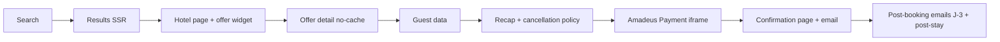

# Booking engine — ConciergeTravel.fr

The booking flow is the **transactional core** (CDC v3.0 §7). It must work flawlessly on mobile within max 3 screens, with native cancellation policy display, real-time prices, and Amadeus-hosted payment.

## Triggers

Invoke when:
- Touching any route under `apps/web/src/app/[locale]/(booking)/`.
- Modifying the state machine in `packages/domain/booking/`.
- Editing post-booking emails (Brevo).
- Implementing the email fallback for hotels with `booking_mode = 'email'`.

## Flow (CDC v3.0 §7.1)

## State machine (`packages/domain/booking/state-machine.ts`)

`idle → offer_locked (TTL ~5 min) → guest_collected → payment_pending → confirmed | failed`

- Transitions are pure functions returning `Result<BookingState, BookingError>`.
- `offer_locked` records `offerId`, `lockedUntil`, snapshot of price + cancellation policy.
- `payment_pending` requires a stored `paymentSessionId`.
- `confirmed` requires a `paymentRef` validated server-side.

## Non-negotiable rules

### SSR no-cache for tunnel
- `export const dynamic = 'force-dynamic'`, `export const fetchCache = 'force-no-store'`, `export const runtime = 'nodejs'`.
- No ISR.
- Each step is its own URL: `/reservation/[offerId]/{chambre,informations,recapitulatif,paiement}` and `/confirmation/[bookingRef]`.

### Step persistence
- Booking draft persisted in `booking_drafts` (server-side) keyed by `draftId` cookie, lifetime 1h.
- Allows back-button without losing data.
- On confirm, draft is finalized into `bookings` and removed.

### Cancellation policy
- Always rendered **before** payment, verbatim from Amadeus or Little response.
- Component `<CancellationPolicy />` accepts the JSON and produces structured display + raw legal text.

### Loyalty integration
- Before recap: compute `loyaltyBenefitsForBooking({ user, hotel })`.
- If user is `customer` and `hotel.is_little_catalog`, show "Avantages Essentiel inclus" card.
- If user is logged in and hotel is **not** Little catalog, show "Passez au tier Prestige" upsell (no blocking).

### Email mode (CDC §5.5, §7.4)
- Hotels with `booking_mode = 'email'` show CTA "Demande de réservation" — no payment iframe.
- Form fields: dates, room preference, party composition, message.
- Server action persists into `booking_requests_email`, sends:
  - Internal email to `reservations@conciergetravel.fr` (Brevo template `booking-request-internal`).
  - Acknowledgement email to guest with 4h response SLA.
- Surfaced in Payload back-office for operator follow-up.

### Email confirmations
- Confirmation email within 30s of payment capture (CDC §12.2). Sent via Brevo templates from `packages/emails/`.
- J-3 reminder via Vercel Cron or Brevo workflow.
- Post-stay loyalty email (request review, suggest tier PREMIUM).

### Errors and recovery
- `OFFER_EXPIRED` → re-fetch offer with same params and prompt user to confirm new price.
- `PAYMENT_FAILED` → keep draft alive, show retry; Sentry capture.
- `BOOKING_CONFLICT` (room sold out between offer and order) → show "désolé, indisponible", offer alternatives via search reusing same dates.

### Idempotency
- Booking finalization keyed on `(draftId, offerId, userId)`.

## Anti-patterns to refuse

- Skipping the offer detail call before payment.
- Running the tunnel as RSC with caching.
- Sending the confirmation email **before** payment is captured.
- Storing card-related anything in `booking_drafts`.
- Showing a custom cancellation policy text overriding the vendor's.

## References

- CDC v3.0 §5 (intégrations), §7 (booking flow), §8 (loyalty), §10 (UX).
- `amadeus-gds`, `little-hotelier`, `payment-orchestration`, `loyalty-program`, `email-workflow-automation` skills.
