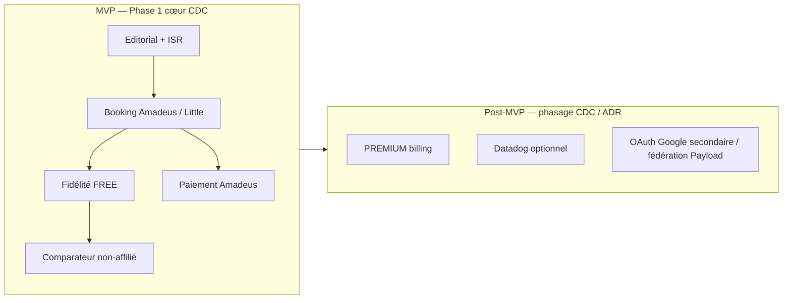

# Conception et phasage — ConciergeTravel.fr

> Point d’entrée pour **reprendre la conception** : lier le cahier des charges (CDC), les livrables documentaires sous `docs/`, les contextes métier et les décisions d’architecture (ADR).

## Références contractuelles

| Référence        | Rôle                                                                                                             |
| ---------------- | ---------------------------------------------------------------------------------------------------------------- |
| **CDC v3.0 §13** | Phasage produit / technique (MVP vs suites) — source de vérité pour les numéros de phase et le périmètre métier. |
| **CDC v3.0 §15** | Livrables documentation (dont cohérence avec ce dépôt).                                                          |
| **`docs/adr/`**  | Écarts intentionnels par rapport au périmètre « complet » (ex. PREMIUM hors vente au MVP).                       |

Les numéros de phase ci-dessous **alignent les en-têtes des documents existants** avec des vagues de travail ; le détail périmètre / calendrier exact reste celui du CDC (fichier hors dépôt si non versionné ici).

---

## Vue synthétique MVP vs après-MVP

---

## Cartographie phase → documentation

Chaque ligne indique **quel document doit être rédigé ou maintenu comme référence** à la clôture du jalon (sans présumer que tout le code soit déjà mergé — vérification = revue + checklist).

| Phase (jalon CDC / doc)          | Focus                                            | Document(s) principal(aux)                                                                                                                                     | Notes                                                                                                                 |
| -------------------------------- | ------------------------------------------------ | -------------------------------------------------------------------------------------------------------------------------------------------------------------- | --------------------------------------------------------------------------------------------------------------------- |
| **1** — Fondations               | Monorepo, stack, couches, matrice de rendu       | [`01-architecture.md`](01-architecture.md), ADR [`0001-stack`](adr/0001-stack.md), [`0002-monorepo-turborepo`](adr/0002-monorepo-turborepo.md)                 | Auth, RLS, Redis, intégrations listées côté architecture.                                                             |
| **2** — Données                  | Schéma Postgres, RLS, JSONB, migrations          | [`02-data-model.md`](02-data-model.md)                                                                                                                         | Modélisation PREMIUM **présente** ; facturation activable plus tard ([`0005`](adr/0005-loyalty-premium-deferred.md)). |
| **3** — Intégrations transverses | GDS, inventaire, comparateur, mails, cache, avis | [`03-integrations/`](03-integrations/) (tous les runbooks)                                                                                                     | Un vendor = un fichier ; aligné skill `api-integration`.                                                              |
| **4** — Recherche                | Algolia                                          | [`03-integrations/algolia.md`](03-integrations/algolia.md), ADR [`0004-algolia`](adr/0004-algolia.md)                                                          |                                                                                                                       |
| **5** + **9** — SEO / GEO / AEO  | Templates + signaux techniques                   | [`04-seo-geo-aeo.md`](04-seo-geo-aeo.md)                                                                                                                       | JSON-LD, hreflang, robots, `llms.txt`, anti-cannibalisation.                                                          |
| **6** — Tunnel                   | Réservation, paiement, idempotence               | [`05-booking-flow.md`](05-booking-flow.md)                                                                                                                     | SSR no-cache tunnel ; politiques d’annulation verbatim.                                                               |
| **7** — Fidélité                 | Tiers, affichage, e-mails                        | [`06-loyalty.md`](06-loyalty.md)                                                                                                                               | PREMIUM vendable = reporté (ADR 0005).                                                                                |
| **8** — Back-office              | Payload, workflows opérateur                     | [`08-backoffice-operations.md`](08-backoffice-operations.md), ADR [`0003-payload-cms`](adr/0003-payload-cms.md)                                                |                                                                                                                       |
| **10** — Exécution               | CI/CD, env, observabilité prod                   | [`07-deployment.md`](07-deployment.md), [`03-integrations/sentry.md`](03-integrations/sentry.md), [`10-environment-variables.md`](10-environment-variables.md) | Deux apps Vercel ; secrets hors repo.                                                                                 |

Les **checklists** ([`09-checklists/`](09-checklists/)) couvrent les critères de passage (SEO, sécurité, QA lancement) définis dans le CDC §12 par analogie.

---

## Contextes métier (DDD) dans le code

Alignement [`01-architecture.md`](01-architecture.md) ↔ emplacements **`packages/domain`** :

| Contexte                                       | Dossier domaine                 |
| ---------------------------------------------- | ------------------------------- |
| `hotels`                                       | `packages/domain/src/hotels`    |
| `booking`                                      | `packages/domain/src/booking`   |
| `loyalty`                                      | `packages/domain/src/loyalty`   |
| `editorial`                                    | `packages/domain/src/editorial` |
| `pricing`                                      | `packages/domain/src/pricing`   |
| Transversal (`Result`, erreurs, branded types) | `packages/domain/src/shared`    |

Les applications **`apps/web`** et **`apps/admin`** composent domain + `packages/integrations` sans dupliquer les règles métier.

---

## Simplifications MVP (piste d’audit)

Toute simplification durable doit avoir un **ADR numéroté** :

| ADR                                                            | Sujet                                                                                                      |
| -------------------------------------------------------------- | ---------------------------------------------------------------------------------------------------------- |
| [0005 — PREMIUM différé](adr/0005-loyalty-premium-deferred.md) | Tier PREMIUM modélisé ; vente / billing en vague ultérieure (CDC + env `LOYALTY_PREMIUM_BILLING_ENABLED`). |

À compléter au fil des écarts réels (captchas, OAuth, etc.) selon les skills concernés.

---

## Reprendre la conception : ordre de travail suggéré

1. **Relire le CDC §13** et cocher le périmètre MVP vs reports explicites.
2. **Parcourir ce tableau** : identifier un document marqué « Phase N » encore trop court (bullet list seule) et le détailler (états, flux, erreurs, owners).
3. **Croiser avec `packages/domain` et `packages/integrations`** : la conception est « bouclée » quand les types et règles domaine reflètent le doc sans contradiction.
4. **Mettre à jour les ADR** avant toute décision qui change périmètre ou stack.
5. **Geler une phase** : exiger doc à jour + checklists §12 + CI verte (cf. skill `technical-documentation`).

---

## Voir aussi

- [`README.md`](../README.md) — vue monorepo et scripts.
- [`01-architecture.md`](01-architecture.md) — détail couches et infra.
- [`docs/adr/`](adr/) — décisions d’architecture.
