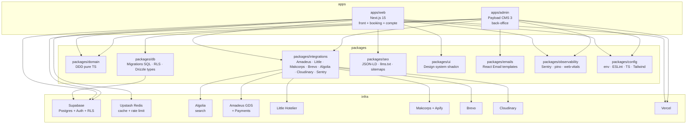

# Architecture — ConciergeTravel.fr

## Vue d'ensemble

ConciergeTravel.fr est organisé en **quatre couches fonctionnelles** (cf. CDC §5) et **deux applications** Next.js partageant une base de packages.

## Couches fonctionnelles

1. **Editorial (SEO/GEO)** — pages pilier, hubs régionaux et villes, fiches hôtels, classements, thématiques, comparatifs, guides, E-E-A-T. Rendu hybride SSG/ISR.
2. **Booking (transactionnel)** — recherche, résultats temps réel, fiche dynamique, tunnel 7 étapes, paiement Amadeus, confirmation, post-booking. SSR no-cache.
3. **Loyalty** — tier FREE auto, tier PREMIUM préparé. Surfaces : fiche, tunnel, espace client, e-mails.
4. **Administration** — Payload CMS 3 pour CRUD hôtels, contenu, FAQ, SEO, réservations, demandes e-mail, fidélité, reporting. Publication sans redéploiement via `revalidateTag`.

## Matrice de rendu (CDC §2.2)

| Type de page | Rendu | Revalidation |
| --- | --- | --- |
| Pilier `/hotels/france/` | SSG | ISR 24h |
| Hub régional / ville | SSG | ISR 12h |
| Fiche hôtel (sans dates) | SSG | ISR 6h |
| Page éditoriale (classement, thématique, guide) | SSG | ISR 24h |
| Résultats de recherche avec dates | SSR | No cache |
| Tunnel de réservation | SSR | No cache |
| API ARI / availabilities | SSR | Cache Redis 3 niveaux |

## Bounded contexts (DDD)

| Contexte | Responsabilités |
| --- | --- |
| `hotels` | Identité, localisation, état de publication, slugs, mode de réservation |
| `booking` | Aggregate Booking, machine à états, parsing politique d'annulation |
| `loyalty` | Règles de tiers, calcul des avantages, éligibilité |
| `pricing` | Normalisation Makcorps/Apify, calcul scénario comparateur |
| `editorial` | Pages éditoriales, slug/hreflang/canonical, validation AEO/FAQ |
| `shared` | `Result<T,E>`, branded types, erreurs |

## Couches de cache

| Niveau | TTL | Usage |
| --- | --- | --- |
| Long | 6h | Fiche hôtel sans dates (description, photos) |
| Court | 15min | Recherche avec dates (Amadeus offers) |
| No cache | — | Lookup pré-paiement (`hotel-offers/{offerId}`) |
| Comparator | 15min | Makcorps / Apify |
| Reviews | 24h | Google Places |

Détails dans le skill `redis-caching` et `docs/03-integrations/upstash-redis.md`.

## Intégrations principales

Voir `docs/03-integrations/` (un fichier par vendor).

## Sécurité

- RLS Supabase native sur toutes les tables business.
- Aucune donnée carte — paiement délégué à Amadeus Payments (PCI scope-out).
- Rate limiting Upstash sur les endpoints publics.
- Secrets exclusivement par variables d'environnement, validés via t3-env.
- Détails dans `docs/09-checklists/security.md` et le skill `security-engineering`.
