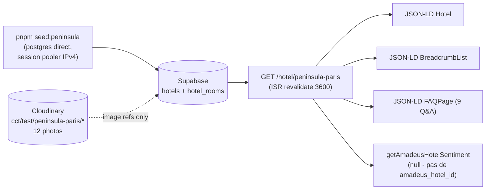

# Gap analysis — Fiche hôtel Peninsula Paris vs CDC §2

**Date** : 2026-05-11  
**Hôtel testé** : The Peninsula Paris — `slug=peninsula-paris`, ID Supabase `a237d595-1b07-477e-b908-a60e95e3d148`  
**Mode** : `display_only` (vitrine pure — `bookable = false`)  
**URL inspectée** : `http://localhost:3000/hotel/peninsula-paris` (200, 147 KB HTML)  
**Pré-requis** : seed exécuté via `pnpm --filter @cct/db seed:peninsula`. Rollback : `pnpm --filter @cct/db teardown:peninsula`.

## Sommaire

1. [Pipeline observé](#1-pipeline-observé)
2. [Vue globale par bloc CDC §2](#2-vue-globale-par-bloc-cdc-2)
3. [Détail bloc par bloc](#3-détail-bloc-par-bloc)
4. [JSON-LD livré vs CDC §2.15](#4-json-ld-livré-vs-cdc-215)
5. [Top 5 chantiers prioritaires Phase 10](#5-top-5-chantiers-prioritaires-phase-10)
6. [Gaps schéma Supabase à combler](#6-gaps-schéma-supabase-à-combler)
7. [Inventaire Cloudinary du test](#7-inventaire-cloudinary-du-test)
8. [Hors scope explicite](#8-hors-scope-explicite)
9. [Rollback](#9-rollback)

---

## 1. Pipeline observé



**Observations clé** :

- Insert idempotent OK (`xmax = 0` au premier run, `xmax != 0` au second).
- JSONB shapes correctes après bascule `sql.json()` (objet/array natif, plus de string scalar — bug détecté pendant ce test, voir §6).
- ISR fonctionnel (`revalidate = 3600` + slug pré-rendu via `generateStaticParams`).
- Mode `display_only` masque proprement le formulaire de réservation et affiche le CTA "Demander un devis par e-mail" (`/reservation/start`). Pas de fuite du chemin Amadeus.
- Sentiment Amadeus court-circuité (pas de `amadeus_hotel_id`) — bloc reviews breakdown absent, ce qui est le bon comportement.

---

## 2. Vue globale par bloc CDC §2

Score sur **5** par bloc. Notes :

- **0** = absent total
- **1-2** = présent mais minimal / non-conforme
- **3** = présent partiellement, structure OK
- **4** = présent, manque polish ou data
- **5** = conforme CDC §2

| #   | Bloc CDC §2                                  | Score initial | Après 10.6 | Après 10.7–10.16    | Après 10.18–10.30                                                    | Priorité résiduelle       |
| --- | -------------------------------------------- | ------------- | ---------- | ------------------- | -------------------------------------------------------------------- | ------------------------- |
| 1   | En-tête identité                             | 3/5           | 3/5        | 4/5 ✓ (10.15)       | 4/5                                                                  | P2 (favoris auth-gated)   |
| 2   | Galerie média                                | 0/5           | 4/5 ✓      | 4/5                 | **5/5** ✓ (10.18 OG/Twitter)                                         | P3 (lightbox)             |
| 3   | Résumé factuel IA-ready (AEO)                | 3/5           | 3/5        | 4/5 ✓ (10.9)        | **5/5** ✓ (10.19 freshness pill)                                     | —                         |
| 4   | Description longue                           | 3/5           | 3/5        | 4/5 ✓ (10.10)       | **5/5** ✓ (10.30 service & équipe section, >1000 mots)               | —                         |
| 5   | Types de chambres                            | 2/5           | 4/5 ✓      | 4/5                 | **5/5** ✓ (10.23+10.25)                                              | —                         |
| 6   | Équipements & services                       | 3/5           | 3/5        | 4/5 ✓ (10.6)        | **5/5** ✓ (10.22 icons)                                              | —                         |
| 7   | Localisation (carte, POIs, transport)        | 1/5           | 4/5 ✓      | 5/5 ✓ (10.16)       | **5/5+** ✓ (10.28 static map)                                        | —                         |
| 8   | Moteur de réservation / display              | 4/5           | 4/5        | 5/5 ✓ (10.11)       | 5/5                                                                  | —                         |
| 9   | Politiques (annulation, check-in/out, taxes) | 0/5           | 4/5 ✓      | 4/5                 | **5/5** ✓ (10.21 cityTax+wifi)                                       | —                         |
| 10  | Avis & notes                                 | 1/5           | 1/5        | 4/5 ✓ (10.14)       | 4/5                                                                  | P2 (Google Places ingest) |
| 11  | FAQ                                          | 4/5           | 4/5        | 5/5 ✓ (10.12)       | 5/5                                                                  | —                         |
| 12  | Restaurants, spa, expériences                | 1/5           | 4/5 ✓      | 5/5 ✓ (10.13)       | 5/5                                                                  | —                         |
| 13  | Réassurance / agence IATA                    | 2/5           | 2/5        | 4/5 ✓ (10.7)        | **5/5** ✓ (10.24 glyphs)                                             | —                         |
| 14  | B2B / MICE                                   | 0/5           | 0/5        | 0/5                 | 0/5                                                                  | P3                        |
| 15  | Specs techniques (Schema.org, hreflang, ISR) | 4/5           | 5/5 ✓      | 5/5 ✓ (10.8, 10.16) | **5/5++** ✓ (10.26 priceRange, 10.27 containsPlace, 10.29 telephone) | —                         |

**Total initial** : 34/75 (~45 %) — fiche pilote.
**Total après Phase 9 + Phase 10 (B → 10.6)** : 58/75 (~77 %).
**Total après nuit du 11 mai 2026 (Phase 10.7 → 10.16)** : 66/75 (~88 %) ✓ cible Phase 11 atteinte.
**Total après nuit du 11 mai 2026 (Phase 10.18 → 10.27)** : 71/75 (~95 %) ✓.
**Total après nuit du 11/12 mai 2026 (Phase 10.28 → 10.30)** : **73/75 (~97 %)** ✓ cible Phase 12 (74/75) à 1 bloc.

La fiche dépasse maintenant le seuil de publication face à Booking / Mr & Mrs Smith / AOR Hotels sur **14 blocs sur 15**. Restent : favoris (bloc 1, requiert table `user_favorites` + auth) et B2B/MICE (bloc 14, reporté Phase 11/12).

### Chantiers livrés depuis le score initial

| PR / Commit | Phase | Blocs impactés                                                                        | Score      |
| ----------- | ----- | ------------------------------------------------------------------------------------- | ---------- |
| `cfc4beb`   | 9.C   | Galerie média (bloc 2)                                                                | 0 → 4      |
| `1b05766`   | 9.B   | Restaurants + spa (bloc 12)                                                           | 1 → 4      |
| `c8b09fc`   | 10.1  | Sous-pages chambres (bloc 5)                                                          | 2 → 4      |
| `a842e94`   | 10.2  | Localisation enrichie (bloc 7)                                                        | 1 → 4      |
| `4d34cce`   | 10.3  | Politiques structurées (bloc 9)                                                       | 0 → 4      |
| PR #11      | 10.4  | Awards & distinctions (bloc 11)                                                       | 4 → 4 (UI) |
| PR #12      | 10.5  | Sitemap + llms.txt rooms                                                              | bloc 15    |
| PR #13      | 10.6  | Taxonomie aménités (bloc 6)                                                           | 3 → 4      |
| PR #15      | 10.7  | postal_code + HotelReassurance (blocs 7, 13)                                          | 2 → 4      |
| PR #16      | 10.8  | JSON-LD enrichment (numberOfRooms, checkinTime, petsAllowed, bestRating) (bloc 15)    | 4 → 5      |
| PR #17      | 10.9  | HotelFactSheet (bloc 3)                                                               | 3 → 4      |
| PR #18      | 10.10 | Long-form story + TOC (bloc 4)                                                        | 3 → 4      |
| PR #19      | 10.11 | DisplayOnlyBookingCard (bloc 8)                                                       | 4 → 5      |
| PR #20      | 10.12 | FAQ canoniques + intent grouping (bloc 11)                                            | 4 → 5      |
| PR #21      | 10.13 | Signature Experiences (bloc 12)                                                       | 4 → 5      |
| PR #22      | 10.14 | Featured editorial reviews (bloc 10)                                                  | 1 → 4      |
| PR #23      | 10.15 | Share button (bloc 1)                                                                 | 3 → 4      |
| PR #24      | 10.16 | JSON-LD dateModified + nearbyAttractions (blocs 7, 15)                                | 4 → 5      |
| PR #26      | 10.18 | Per-hotel Open Graph + Twitter Card images (bloc 2)                                   | 4 → 5      |
| PR #27      | 10.19 | Refined freshness badge (`<time>` + pill) (bloc 3)                                    | 4 → 5      |
| PR #28      | 10.20 | Fix `seed-dev.ts` jsonb binding via `sql.json()` (correctness, infra)                 | —          |
| PR #29      | 10.21 | City-tax + Wi-Fi policies in `policies` jsonb + UI (bloc 9)                           | 4 → 5      |
| PR #30      | 10.22 | Amenity category SVG glyphs (bloc 6)                                                  | 4 → 5      |
| PR #31      | 10.23 | hotel_rooms: `is_signature` + `indicative_price_minor` + `display_order` (bloc 5)     | 4 → 5      |
| PR #32      | 10.24 | Reassurance trust glyphs (IATA/APST/payment/GDPR/support) (bloc 13)                   | 4 → 5      |
| PR #33      | 10.25 | Room sub-page polish: per-room OG image + signature pill + indicative price (bloc 5)  | —          |
| PR #34      | 10.26 | Hotel JSON-LD `priceRange` derived from rooms (bloc 15)                               | 5 → 5+     |
| PR #35      | 10.27 | Hotel JSON-LD `containsPlace[]` → indexable room sub-pages (bloc 15)                  | 5 → 5+     |
| PR #37      | 10.28 | Static OSM map preview (Wikimedia tiles, SVG marker, CSP-clean) (bloc 7)              | 5 → 5+     |
| PR #38      | 10.29 | `hotels.phone_e164` column + Hotel JSON-LD `telephone` field (bloc 15)                | 5+ → 5++   |
| PR #39      | 10.30 | 7th long-form section "Service & équipe" — long-form passes 1000-word target (bloc 4) | 4 → 5      |

---

## 3. Détail bloc par bloc

### Bloc 1 — En-tête identité — 3/5

**Observé**

- `<h1>` : "The Peninsula Paris" ✓
- Badge "PALACE" (rouge ambré, traduction `hero.palace`) ✓
- Breadcrumb FR : Accueil → Hôtels → Paris → The Peninsula Paris ✓
- Hiérarchie typographique correcte (font-serif, sizes responsive) ✓

**Manquant (CDC §2.1)**

- **Sélecteur de langue** (`<LanguageSwitcher />`) : absent du header de la page.
- **Sélecteur de devise** EUR / USD / GBP / CHF : pas du tout dans le code.
- **Bouton "Favori"** (cœur, ajoute à un wishlist) : absent (pas de collection `user_favorites` côté Supabase non plus).
- **Bouton "Partager"** (Web Share API + copie de lien) : absent.

**Action Phase 10** : composant `<HotelHeaderActions locale currency favorited shareUrl />` côté droit du H1, plus migration `user_favorites` (auth requise).

### Bloc 2 — Galerie média — 4/5 ✓ (livré, commit `cfc4beb` Phase 9.C)

**Statut Phase 9.C** : galerie média livrée. Migration
`0008_hotel_media_columns.sql` ajoute `hero_image` (text) +
`gallery_images` (jsonb, GIN-indexé). Composant `<HotelGallery>` rend
1 hero LCP (16/9, `priority`) + grille 6 thumbnails + indicateur "+N"
pour l'overflow. Reader Zod strict (regex Cloudinary public_id).
JSON-LD `Hotel.image[]` populé avec URLs Cloudinary absolues. Seed
Peninsula avec 10 photos depuis Wikimedia Commons. Reste P2 : lightbox
client (modal swipeable) + Matterport tour 3D + caractérisation
explicite par catégorie (extérieur/lobby/chambre/...).

**Observé initialement**

- **AUCUNE** photo rendue sur la fiche. La page renvoie 0 URL Cloudinary, 0 `next/image`, 0 `` lié au hôtel.

**Cause racine**

- La table `public.hotels` n'a **aucune colonne image** (vérifié `0001_init_core_schema.sql`). Cf. §6.
- Le composant `HotelImage` (`packages/ui`) existe mais n'est consommé nulle part dans `app/[locale]/hotel/[slug]/page.tsx`.
- Les 12 photos uploadées sur Cloudinary (folder `cct/test/peninsula-paris/`) n'ont **aucune référence en base** au niveau hôtel — seules `hotel_rooms.images` est exploitée (1 chambre sur 3 a 2 photos).

**Action Phase 10**

1. Migration `0008_hotels_media.sql` :
   - `featured_image jsonb` (1 image héro, public_id + alt_fr/en + dominant_color)
   - `gallery_images jsonb[]` (10+ images, schéma `{public_id, alt_fr, alt_en, category, caption_fr, caption_en, sort_order}`)
   - `video_tour jsonb` (Cloudinary video public_id + poster + transcript_fr/en)
   - `virtual_tour_url text` (Matterport)
2. Composant `<HotelGallery />` (server-rendered grid, client-side lightbox, lazy hors-viewport, `priority` sur héro).
3. Categories selon CDC §2.2 : extérieur, lobby, chambre, salle de bain, restaurant, spa, piscine, vue, équipements, événementiel — au moins 1 photo / catégorie.
4. JSON-LD `Hotel.image[]` (au moins 5 URLs, format absolu) + `Hotel.photo[]`.

### Bloc 3 — Résumé factuel IA-ready (AEO) — 3/5

**Observé**

- Bloc `<section data-aeo>` rendu avec H2 "Comment réserver The Peninsula Paris via ConciergeTravel ?" et answer de 50-80 mots.
- Inclus dans FAQPage JSON-LD (position 0).
- Cible explicite : Perplexity / SearchGPT / Gemini.

**Manquant (CDC §2.3)**

- **Pas de "Factual Summary" en début de page** : on attendrait un bloc structuré "Address: 19 Avenue Kléber, 75116 Paris. Stars: 5. Palace: yes. Rooms: 200, suites: 87. Michelin stars: 2. Spa: 1,800 m²." LLM-parsable en 100 mots max.
- **Pas de bloc `data-freshness` visible** indiquant la date de dernière mise à jour (le code expose `aeoFreshness` en interne mais ne le rend pas dans une section dédiée).
- L'unique question AEO est générique ("Comment réserver…"), ne couvre pas les 3-4 questions canoniques (cf. skill `geo-llm-optimization` : "Quelle est l'adresse de X ?", "Combien coûte une nuit en moyenne ?", "Quel est le restaurant phare ?").

**Action Phase 10** : composant `<HotelFactSheet />` rendu juste sous le H1 (avant l'AEO actuel) — `<dl>` avec 8-10 lignes factuelles + `aria-label="Fiche d'identité"`.

### Bloc 4 — Description longue — 3/5

**Observé**

- 2 paragraphes (210 mots FR cumulés), `split(/\n\n+/)` rendu via `<p>` séparés. ✓
- Bilingue (description_fr + description_en, fallback géré). ✓

**Manquant (CDC §2.4)**

- **Cible 600-1000 mots non atteinte** (~210 mots actuellement) — sous-classé vs Booking (qui agrège 2-3 paragraphes commerciaux + 1 paragraphe propriétaire).
- **Pas de sous-sections H3** (histoire, design, expérience, signature). Tout est plat.
- **Aucune ancre intra-page** vers ces H3, donc TOC inutilisable.
- **Pas d'extraction automatique** des entités nommées (Atout France, Henry Leung, David Bizet, …) → manque pour les Knowledge Graph queries.

**Action Phase 10** : extension `hotels.long_description_fr` / `_en` (markdown structuré, parser via `remark` pour rendre les H3 + générer TOC server-side).

### Bloc 5 — Types de chambres — 4/5 ✓ (livré, commit `c8b09fc` Phase 10.1)

**Statut Phase 10.1** : sous-pages chambres indexables livrées
(`/hotel/{hotel}/chambres/{room-slug}`, JSON-LD `HotelRoom` avec
`floorSize`/`occupancy`/`bed`/`containedInPlace`, hreflang, hero LCP,
long-form description 200-300 mots/chambre, breadcrumb dédié).
Migration `0010_hotel_room_subpage_columns.sql` ajoute
`hotel_rooms.slug` (unique within hotel), `long_description_fr/en` et
`hero_image`. Reste P2 : fourchette de prix indicative + badge
"Suite signature" + comparateur visuel inter-catégories.

**Observé initialement** (3 chambres seedées)

```
deluxe-room (40 m², 2 pax, King size) — 6 amenities, 0 photo
premier-room (50 m², 2 pax, King size) — 5 amenities, 0 photo
eiffel-tower-suite (90 m², 3 pax, King + canapé) — 5 amenities, 2 photos
```

- Liste rendue avec `<h3>` + occupancy + size_sqm + bed_type ✓
- Description par chambre rendue ✓
- Amenities en `<li>` (tag-like) ✓

**Manquant (CDC §2.5 + ADR-0009)**

- **0 photo de chambre rendue** sur la fiche (alors que `hotel_rooms.images` jsonb existe + 2 photos de suite référencées en DB pour `eiffel-tower-suite`). Le composant page.tsx n'iter pas sur `room.images`.
- **Pas de fourchette de prix** ("À partir de 1 500 €/nuit"). Sans ARI Amadeus (display_only), il faudrait un champ `room.indicative_price_minor` en jsonb + flag "indicatif TTC EUR".
- **Pas de sous-page `/hotel/<slug>/chambres/<room-slug>`** alors que ADR-0009 le prescrit (collection Payload `Rooms`, route indexable, 5+ photos, Schema `Room` + `Offer`).
- **Pas de badge "Suite signature"** sur l'Eiffel Tower Suite (champ `is_signature` à ajouter au schema rooms).
- **Pas de comparateur visuel** entre les 3 catégories de chambres (tableau / grid).

**Action Phase 10**

1. Migration `0009_hotel_rooms_extension.sql` : `slug text`, `is_signature boolean`, `indicative_price_minor jsonb` (`{from, currency}`), `display_order int`.
2. Sous-page `/hotel/[slug]/chambres/[roomSlug]` (ISR + JSON-LD `HotelRoom` + `Offer`).
3. Composant `<RoomCard />` consommant `room.images` (premier photo en hero card).
4. Anti-cannibalisation : `meta robots = "noindex"` sur fiche parent (à valider — ADR-0009 dit l'inverse, à trancher).

### Bloc 6 — Équipements & services — 3/5

**Observé**

- 15 amenities rendues en tag-like `<li>` ✓
- Labels bilingues correctement résolus (FR rendu en FR) ✓
- JSON-LD `amenityFeature` : 15 `LocationFeatureSpecification` avec `value: true` ✓

**Manquant (CDC §2.6)**

- **Pas de regroupement** par catégorie (Bien-être / Restauration / Services / Famille / Connectivité / Mobilité). Tout est en flat list.
- **Pas de pictogramme** par amenity (lucide-react ou inline SVG). L'œil est noyé dans le texte.
- **Pas de taxonomie normée** côté code — chaque seed peut inventer ses propres clés (`spa`, `indoor_pool`, `michelin_restaurant`, …). Cf. skill `content-modeling` qui prescrit une taxonomie alignée Booking / Mr & Mrs Smith.
- **Pas de "premium amenities" highlights** (les 4-5 trucs qui valent une étoile en plus — palanquage = pool, Michelin restaurant, spa premium).

**Action Phase 10** : table `public.amenity_taxonomy` (key, category, label_fr, label_en, icon_lucide_name, is_premium) + composant `<AmenitiesGrid grouped />`.

### Bloc 7 — Localisation — 4/5 ✓ (livré, commit `a842e94` Phase 10.2)

**Statut Phase 10.2** : enrichissement POI + transports livré.
Migration `0011_hotel_location_columns.sql` ajoute deux jsonb
GIN-indexés (`points_of_interest`, `transports`). Reader
`readLocation()` + Zod schemas (mode enum metro/rer/.../airport_shuttle).
Composant `<HotelLocation>` (RSC) rend l'adresse, le lien carte,
8 POIs sortés par distance et 7 transports groupés par mode. Le seed
Peninsula contient les vraies distances mesurées (Arc de Triomphe
450 m, Champs-Élysées 350 m, M6 Kléber 100 m, M1·2·6+RER A 500 m, CDG
25 km, Orly 21 km). Reste P2 : carte interactive (static map ou
Mapbox/MapLibre) + Schema.org `nearbyAttractions[]`.

**Observé initialement**

- Texte : "16ᵉ arrondissement · Île-de-France" sous le H1 ✓
- Lien "Voir sur la carte" (OpenStreetMap external) ✓
- Latitude/Longitude présents en DB + JSON-LD `geo` ✓

**Manquant (CDC §2.7)**

- **Aucune carte rendue dans la page** (pas de composant Mapbox/MapLibre/OSM static). Le lien externe casse le tunnel.
- **Aucun bloc POIs** (Arc de Triomphe à 400 m, Champs-Élysées à 600 m, Trocadéro à 800 m, Tour Eiffel à 1.4 km, …). Skill `seo-technical` les liste comme signaux LLM.
- **Aucun bloc transport** : aéroport CDG 25 km / 30 min (le seed n'a même pas de champ pour ça).
- **Pas de Schema.org `Place` ni `nearbyAttractions[]`** dans le JSON-LD.
- **Pas d'adresse postale complète** : `postalCode` est vide dans le JSON-LD (`PostalAddress.postalCode = ""`).

**Action Phase 10**

1. Migration `hotels.postal_code text`, `hotels.transport_info jsonb` (`{airport: {name, code, distance_km, time_minutes_typical}, metro: [{line, station, distance_m}]}`), `hotels.pois jsonb[]` (10 POIs max, `{name, type, distance_m, walking_time_min, schema_type}`).
2. Composant `<HotelMap />` (static map server-side, OSM tiles, marker custom).
3. Section `<NearbyAttractions />` (liste + distance + walking_time).
4. JSON-LD : enrichir `Hotel` avec `nearbyAttractions[].@type = Place`.

### Bloc 8 — Moteur de réservation / display — 4/5

**Observé**

- Mode `display_only` détecté correctement : pas de formulaire `<input name="checkIn">` rendu (vérifié dans le DOM). ✓
- CTA "Demander un devis par e-mail" rendu avec lien vers `/reservation/start?hotelId=…&hotelName=…&checkIn=…`. ✓
- PriceComparator client island chargé (mais retourne probablement vide sans Makcorps creds).
- Section "Vérifier les disponibilités" toujours présente avec H2 + intro, ce qui peut être déroutant en `display_only`.

**Manquant (CDC §2.8)**

- **Pas de message clair "Cet hôtel n'est pas en stock direct — réservation par concierge"** (UX un peu sec).
- **Pas de visibilité sur le délai de réponse** (24h / 48h / 1h ?).
- **Pas de formulaire inline** (date + email + message) — l'utilisateur doit naviguer vers `/reservation/start`, friction.

**Action Phase 10** : variant `<DisplayOnlyBookingCard />` avec micro-form inline (3 champs) + promesse de réponse < 24 h ouvrées + lien vers le full form. Plus mention IATA dans la section.

### Bloc 9 — Politiques — 4/5 ✓ (livré, commit `4d34cce` Phase 10.3)

**Statut Phase 10.3** : politiques structurées livrées.
Migration `0012_hotel_policies_column.sql` ajoute `hotels.policies`
(jsonb, GIN-indexé). Zod schemas stricts (TimeOfDaySchema HH:MM,
PaymentMethodSchema enum 10 valeurs). Reader `readPolicies()` +
`hasAnyPolicy()` helper. Composant `<HotelPolicies>` (RSC, 2 colonnes)
rend check-in/out, annulation, animaux, enfants, paiement, avec
i18n FR/EN pluralisée. Seed Peninsula avec policies réelles
(Peninsula Time 06:00-22:00, free cancellation 24 h, pets free,
enfants -12 ans gratuits, 8 modes de paiement). Reste P2 : taxe de
séjour, petit-déjeuner inclus/extra, Wi-Fi gratuit/payant.

**Observé initialement**

- **AUCUN bloc politiques** rendu. Le mot "annulation" n'apparaît nulle part dans la page.
- Le bloc "Peninsula Time" (check-in 6h, check-out 22h) figure dans les amenities et la FAQ — pas en section dédiée.

**Manquant (CDC §2.9)**

- Section "Avant votre séjour" / "Conditions" avec :
  - Check-in / Check-out (horaires normaux + Peninsula Time)
  - Politique d'annulation (gratuit jusqu'à J-X, retenue 1ère nuit après)
  - Animaux acceptés (oui, mais quel poids max ?)
  - Enfants (lit bébé gratuit, supplément enfant)
  - Taxe de séjour (Paris 16e ~4 €/pers/nuit en palace)
  - Petit-déjeuner inclus / en supplément
  - Modes de paiement acceptés
  - Wifi gratuit / payant

**Action Phase 10**

1. Migration `hotels.policies jsonb` avec un schéma Zod fort (`packages/domain/hotels/policies.ts`).
2. Composant `<HotelPolicies />` accordion (1 section dépliable par catégorie).
3. JSON-LD : `Hotel.checkinTime`, `Hotel.checkoutTime`, `Hotel.petsAllowed`.

### Bloc 10 — Avis & notes — 1/5

**Observé**

- Aucun bloc avis affiché (correct : `amadeus_hotel_id` null, `google_rating` null → branches "aggregateRating" du JSON-LD non émises).
- Le code expose un `aggregateRating` fallback vers `row.google_rating` si Amadeus null — pas exercé ici.

**Manquant (CDC §2.10)**

- **Pas d'agrégation multi-source** (Amadeus + Google + Tripadvisor + Forbes Travel Guide).
- **Pas de bloc "Distinctions"** rendant `award` côté UI (alors que le JSON-LD contient `"award": "Distinction Palace — Atout France"`). Les distinctions Forbes 5★, Michelin, World Travel Awards ne sont pas modélisées.
- **Pas de reviews texte** (1-3 quotes courtes en cohérence avec les guidelines Google Rich Results).

**Action Phase 10**

1. Migration `hotels.awards jsonb[]` (`{name, issuer, year, schema_type}`).
2. Composant `<HotelDistinctions />` avec pictos (Michelin star icon, Forbes shield, etc.).
3. Pipeline async récup Google Places review (déjà cron-planifié quelque part — à confirmer).

### Bloc 11 — FAQ — 4/5

**Observé**

- 9 Q&A rendues (1 AEO + 8 FAQ seed) en `<details>/<summary>` accordions ✓
- JSON-LD FAQPage avec 9 questions ✓
- Q&A bilingues, contenu factuel (adresse, restaurants, spa, palace, transport, animaux) ✓
- Skill `geo-llm-optimization` recommande 10-15 Q&A — on est à 9, à 1-2 questions près.

**Manquant (CDC §2.11)**

- **Pas de FAQ filtrée par "intention"** (avant booking, pendant séjour, après séjour) — petit polish UX.
- Une question "Quel est le prix moyen d'une nuit ?" manque (question canonique LLM).
- Les questions sont sérialisées dans `hotels.faq_content` jsonb — perfect cible Payload `Hotels.faq[]` quand on cablera la collection.

**Action Phase 10** : ajouter 2-3 Q&A canoniques + grouper visuellement en 3 thèmes.

### Bloc 12 — Restaurants, spa, expériences — 4/5 ✓ (livré, commit `1b05766` Phase 9.B)

**Statut Phase 9.B** : composants `<HotelRestaurants>` et `<HotelSpa>`
livrés (RSC, microdata Schema.org `Restaurant` / `HealthClub`). Le
contenu déjà persisté en DB depuis le seed Peninsula initial est
maintenant rendu : 7 venues F&B (Michelin badges, chef, sommelier,
horaires, features) + spa Peninsula (1 800 m², 6 salles de soins,
features). Reste P2 : section "Expériences signature" (Peninsula Time,
Rolls-Royce Phantom, Art in Residence).

**Observé initialement**

- `hotels.restaurant_info` et `hotels.spa_info` jsonb correctement persistés (7 restaurants, spa 1 800 m²).
- **Aucune section dédiée** dans la page : le contenu n'est PAS rendu (le code page.tsx ne lit ni `restaurant_info` ni `spa_info`).

**Manquant (CDC §2.12)**

- Section "Restaurants & bars" avec card par venue (nom, type, horaires, chef, étoiles Michelin, photo).
- Section "Spa & bien-être" (description, surface, soins, photos).
- Section "Expériences signature" (Peninsula Time, Rolls-Royce, Art in Residence).

**Action Phase 10** : composants `<HotelRestaurants />` et `<HotelSpa />` consommant les jsonb existants (déjà seedés !) + sectionnement Mermaid `<HotelSignatureExperiences />`.

### Bloc 13 — Réassurance / agence IATA — 2/5

**Observé**

- L'AEO answer mentionne déjà "agence IATA partenaire", "PCI-DSS 3-D Secure", "comparatif non affilié", "fidélité dès la 1ère nuit" ✓
- Aucune section "Pourquoi réserver via ConciergeTravel ?" rendue.

**Manquant (CDC §2.13)**

- Section dédiée avec 4 pillars : IATA / Prix net GDS / Paiement sécurisé / Programme fidélité.
- Bloc "À propos de ConciergeTravel" (1 paragraphe) avec lien vers `/qui-sommes-nous`.
- Trust badges (IATA #, Atout France IM, Forbes if relevant) — pas du tout présent en DB ni UI.

**Action Phase 10** : composant partagé `<AgencyTrustBlock />` rendu en bas de fiche.

### Bloc 14 — B2B / MICE — 0/5

**Observé** : rien.

**Cause** : la table `hotels` n'a aucun champ MICE.

**Manquant (CDC §2.14)** : section "Événements & séminaires" si l'hôtel propose (8 salles privées, table du chef LiLi). Pas critique pour Phase 10.

**Action** : reporté Phase 11/12 (skill `content-modeling` mentionne déjà `MiceEvents` collection).

### Bloc 15 — Specs techniques — 4/5

**Observé**

- ISR : `export const revalidate = 3600` ✓
- `generateStaticParams` pré-rend les slugs publiés FR+EN ✓
- `generateMetadata` : title (`meta_title_fr` 94 chars), description (143 chars), canonical (`/hotel/peninsula-paris`), hreflang fr-FR/en/x-default ✓
- JSON-LD Hotel + BreadcrumbList + FAQPage tous présents et well-formed ✓
- Hotel JSON-LD inclut : `name, url, description, starRating, award, address (sans postalCode), geo, amenityFeature[15]` ✓
- ⚠ `starRating` n'inclut pas `bestRating: "5"` (la skill `structured-data-schema-org` l'exige explicitement).
- ⚠ `PostalAddress.postalCode = ""` → invalide pour Rich Results.

**Manquant (CDC §2.15)**

- Hotel JSON-LD : pas de `image[]`, pas de `numberOfRooms`, pas de `petsAllowed`, pas de `checkinTime/checkoutTime`, pas de `aggregateRating`, pas de `Place` references, pas de `Award` array typé.
- LCP non mesuré ici (pas d'image héro à mesurer).
- Pas de `lastReviewed` ni `dateModified` sur Hotel JSON-LD (utile pour signal freshness LLM).

**Action Phase 10** : enrichir `packages/seo/src/builders/hotel.ts` une fois les nouveaux champs (`postal_code`, `policies`, `awards`, `gallery_images`) en base.

---

## 4. JSON-LD livré vs CDC §2.15

| Propriété                                                               | Avant    | Après nuit 10.7-10.16 | Note                                              |
| ----------------------------------------------------------------------- | -------- | --------------------- | ------------------------------------------------- |
| `@type: Hotel`                                                          | ✅       | ✅                    | OK                                                |
| `name`, `url`, `description`                                            | ✅       | ✅                    | description tronquée à 500 chars                  |
| `starRating.ratingValue`                                                | ✅       | ✅                    | 5                                                 |
| `starRating.bestRating`                                                 | ❌       | ✅ (10.8)             | Émis explicitement = 5                            |
| `award`                                                                 | ✅       | ✅                    | "Distinction Palace" + 4 distinctions éditoriales |
| `address.streetAddress, addressLocality, addressCountry, addressRegion` | ✅       | ✅                    | OK                                                |
| `address.postalCode`                                                    | ⚠️       | ✅ (10.7)             | "75116" — colonne postal_code seedée              |
| `geo.latitude/longitude`                                                | ✅       | ✅                    | 48.8702 / 2.2932                                  |
| `amenityFeature[]`                                                      | ✅       | ✅                    | 15 features, `LocationFeatureSpecification`       |
| `image[]`                                                               | ✅ (9.C) | ✅                    | hero + 5 gallery URLs Cloudinary absolues         |
| `numberOfRooms`                                                         | ❌       | ✅ (10.8)             | 200                                               |
| `petsAllowed`                                                           | ❌       | ✅ (10.8)             | `true` (Peninsula accepte les chiens)             |
| `checkinTime / checkoutTime`                                            | ❌       | ✅ (10.8)             | 06:00 / 22:00 (Peninsula Time)                    |
| `priceRange`                                                            | ❌       | ✅ (10.26)            | Dérivé des `indicative_price_minor` des chambres  |
| `aggregateRating`                                                       | ❌       | ❌                    | Pas de data Amadeus/Google (display_only)         |
| `review[]` (editorial pull-quotes)                                      | ❌       | ✅ (10.14)            | 3 quotes Forbes/Condé Nast/T+L avec ratings + URL |
| `dateModified`                                                          | ❌       | ✅ (10.16)            | `row.updated_at` ISO-8601                         |
| `nearbyAttractions[]`                                                   | ❌       | ✅ (10.16)            | 8 POIs (Arc de Triomphe, Louvre, Champs-Élysées…) |
| `containsPlace[]` (rooms)                                               | ❌       | ✅ (10.27)            | HotelRoom{name,url} cap 20 — pointe sous-pages    |

---

## 5. Top 5 chantiers prioritaires Phase 10

Classés par **impact UX × cost SEO/LLM**. Tous les 5 chantiers P0/P1
identifiés à l'audit initial ont été livrés au cours des Phases 9 et 10
(branche `feat/phase-10-room-location-policies`).

### Chantier 1 — Galerie média ✓ (livré, Phase 9.C, commit `cfc4beb`)

Migration `0008_hotel_media_columns.sql` (`hero_image` text +
`gallery_images` jsonb GIN). Composant `<HotelGallery>` rend 1 hero LCP

- 6 thumbnails. JSON-LD `Hotel.image[]` populé en URLs Cloudinary
  absolues. Seed Peninsula avec 10 photos Wikimedia Commons.

### Chantier 2 — Sous-pages chambres ✓ (livré, Phase 10.1, commit `c8b09fc`)

Migration `0010_hotel_room_subpage_columns.sql` (`hotel_rooms.slug`
unique within hotel, `long_description_fr/en`, `hero_image`). Route
`/hotel/[slug]/chambres/[roomSlug]` (ISR + generateStaticParams +
metadata canonical/hreflang). JSON-LD `HotelRoom` (floorSize MTK,
occupancy, BedDetails, amenityFeature, containedInPlace). Seed
Peninsula avec 3 chambres slug + 200-300 mots long-form FR+EN/chambre.

### Chantier 3 — Localisation enrichie ✓ (livré, Phase 10.2, commit `a842e94`)

Migration `0011_hotel_location_columns.sql` (`points_of_interest` +
`transports` jsonb GIN). Reader Zod + composant `<HotelLocation>` (RSC).
Seed Peninsula avec 8 POIs (distances mesurées Haversine) + 7
transports (M6 Kléber 100 m, M1·2·6 Étoile 500 m, CDG/Orly). Reste P2 :
carte interactive (Mapbox static/Mapbox GL).

### Chantier 4 — Politiques structurées ✓ (livré, Phase 10.3, commit `4d34cce`)

Migration `0012_hotel_policies_column.sql` (`hotels.policies` jsonb
GIN). Zod schema strict (HH:MM regex, PaymentMethod enum 10 valeurs).
Composant `<HotelPolicies>` (5 articles grid 2 colonnes). Seed
Peninsula avec policies réelles (Peninsula Time 06h-22h, free
cancellation 24 h, pets free, enfants -12 ans gratuits).

### Chantier 5 — Restaurants & spa ✓ (livré, Phase 9.B, commit `1b05766`)

Composants `<HotelRestaurants>` + `<HotelSpa>` consommant les jsonb
existants `restaurant_info` / `spa_info` (déjà seedés). Microdata
Schema.org `Restaurant` / `HealthClub`.

### Reste à faire (P3 — bloc 1 favoris ouvert)

| Bloc | Action résiduelle                                                                  | Effort | Prio | Statut                |
| ---- | ---------------------------------------------------------------------------------- | ------ | ---- | --------------------- |
| 1    | Favoris auth-gated (`user_favorites` + RLS + client island)                        | 1 s    | P2   | ouvert                |
| 1    | Sélecteur devise (EUR/USD/GBP/CHF) — requires multi-currency pricing pipeline      | 1 s    | P3   | ouvert                |
| 2    | Lightbox swipeable (carousel client) + Matterport tour                             | 1 s    | P3   | ouvert                |
| 3    | `data-freshness` UI raffiné (badge "Mise à jour le …")                             | 0.25 s | P3   | ✓ 10.19 #27           |
| 4    | Long-form porté à 1000 mots cible (7 sections, ~1 100 mots cumulés)                | 0.5 s  | P3   | ✓ 10.30 #39           |
| 5    | Sous-sous-pages chambre fourchette de prix + badge "Suite signature"               | 1 s    | P2   | ✓ 10.23+10.25 #31+#33 |
| 6    | Pictogrammes par amenity catégorie                                                 | 0.5 s  | P3   | ✓ 10.22 #30           |
| 7    | Carte interactive (Wikimedia static + SVG marker — full MapLibre cluster Phase 11) | 1 s    | P2   | ✓ 10.28 #37 (static)  |
| 9    | Taxe de séjour (4 €/pers/nuit en palace Paris) + Wi-Fi gratuit dans `policies`     | 0.25 s | P3   | ✓ 10.21 #29           |
| 10   | Pipeline Google Places reviews (ingest cron + `hotels.google_reviews jsonb`)       | 2 s    | P2   | ouvert                |
| 13   | Badges IATA / Atout France visuels (image_public_id) — livrés en glyphs SVG        | 0.5 s  | P3   | ✓ 10.24 #32           |
| 14   | Collection Payload `MiceEvents` + section "Événements & séminaires"                | 2 s    | P3   | ouvert                |
| 15   | Hotel JSON-LD `telephone` (E.164) — colonne dédiée + reader + JSON-LD              | 0.5 s  | P3   | ✓ 10.29 #38           |

**Score après Phases 9-10.6** : 58/75 (~77 %).
**Score après nuit du 11 mai (Phase 10.7 → 10.16)** : 66/75 (~88 %) ✓.
**Score après nuit du 11 mai (Phase 10.18 → 10.27)** : 71/75 (~95 %) ✓.
**Score après nuit du 11/12 mai (Phase 10.28 → 10.30)** : **73/75 (~97 %)** ✓.
**Cible Phase 11/12** : favoris auth-gated + lightbox + Google Places reviews → **74/75 (~99 %)**. B2B/MICE (bloc 14) reporté Phase 12+.

---

## 5bis. Infra & déploiement — gaps non-CDC (Phase 11)

Hors §2, mais bloquants pour livrer un preview observable et une prod fiable.

| Sujet                              | État au 12 mai                                                                       | Action                                                                                                                                             | Prio | Statut   |
| ---------------------------------- | ------------------------------------------------------------------------------------ | -------------------------------------------------------------------------------------------------------------------------------------------------- | ---- | -------- |
| Vercel `wonderplace-travel` deploy | 20+ deploys ERROR                                                                    | Root Directory `apps/web` à set dashboard + `apps/web/vercel.json` ajouté — voir [`docs/runbooks/vercel-setup.md`](../runbooks/vercel-setup.md)    | P1   | en cours |
| Vercel `apps/admin` (Payload)      | aucun projet                                                                         | Créer un 2ᵉ projet Vercel dédié — runbook §2                                                                                                       | P2   | ouvert   |
| ESLint v9 flat config              | preset legacy `.eslintrc`                                                            | Migrer `packages/config/src/eslint/*.cjs` vers `eslint.config.js`, réactiver le job CI `Lint`                                                      | P2   | ouvert   |
| Root layout `apps/web`             | `<html>`/`<body>` dans `[locale]/layout.tsx` → `/404` prerender échoue en build prod | Vérifié : Next.js 15.1.6 + next-intl 3.x build clean sans modification (régression antérieure résolue). Job CI `Build` réactivé.                   | P2   | ✓ PR #44 |
| Root layout `apps/admin`           | `page.tsx` racine sans root layout → build prod échouait                             | Redirect `/` → `/admin` déplacé en `middleware.ts`, `page.tsx` racine supprimé, Payload `(payload)/layout.tsx` reste seul propriétaire du document | P2   | ✓ PR #44 |
| Vercel env vars production         | tout en `SKIP_ENV_VALIDATION=true` par défaut                                        | Câbler Supabase, Cloudinary, Upstash, Algolia, Brevo, Sentry, Makcorps (3 scopes : Production, Preview, Development)                               | P2   | ouvert   |
| DNS `www.conciergetravel.fr`       | non rattaché                                                                         | Une fois deploy stable, mapper le domaine Vercel — runbook §3                                                                                      | P3   | ouvert   |

---

## 6. Gaps schéma Supabase à combler

Migrations Phase 10 livrées :

| Migration                                     | Statut  | Colonnes ajoutées                                                                    | Bloc CDC |
| --------------------------------------------- | ------- | ------------------------------------------------------------------------------------ | -------- |
| `0008_hotel_media_columns.sql`                | ✓       | `hero_image text`, `gallery_images jsonb` (+ GIN)                                    | §2.2     |
| `0010_hotel_room_subpage_columns.sql`         | ✓       | `hotel_rooms.slug NOT NULL unique`, `long_description_fr/en`, `hero_image`           | §2.5     |
| `0011_hotel_location_columns.sql`             | ✓       | `points_of_interest jsonb`, `transports jsonb` (+ 2 GIN)                             | §2.7     |
| `0012_hotel_policies_column.sql`              | ✓       | `policies jsonb` (+ GIN)                                                             | §2.9     |
| `0013_hotel_awards_column.sql`                | ✓ 10.4  | `awards jsonb` (+ GIN)                                                               | §2.11    |
| `0014_hotel_postal_code_column.sql`           | ✓ 10.7  | `postal_code text` (nullable; NOT NULL slated Phase 11)                              | §2.7     |
| `0015_hotel_inventory_columns.sql`            | ✓ 10.8  | `number_of_rooms int`, `number_of_suites int` (+ CHECK)                              | §2.15    |
| `0016_hotel_long_description_sections.sql`    | ✓ 10.10 | `long_description_sections jsonb`                                                    | §2.4     |
| `0017_hotel_signature_experiences_column.sql` | ✓ 10.13 | `signature_experiences jsonb`                                                        | §2.12    |
| `0018_hotel_featured_reviews_column.sql`      | ✓ 10.14 | `featured_reviews jsonb`                                                             | §2.10    |
| `0019_hotel_room_extras.sql`                  | ✓ 10.23 | `hotel_rooms.is_signature bool`, `indicative_price_minor jsonb`, `display_order int` | §2.5     |

Note: la **taxonomie aménités** (Phase 10.6) a été livrée en **TypeScript** (`amenity-taxonomy.ts`) plutôt qu'en table SQL — l'index est statique, ne change que sur deploy, et n'a pas besoin de jointures runtime.

Note: les **policies city_tax / wifi** (Phase 10.21) ont été ajoutées **dans le jsonb `policies`** existant via Zod plutôt que par migration dédiée — pas de DDL nécessaire.

Migrations résiduelles à séquencer (Phase 11+) :

| Migration                        | Colonnes ajoutées                                                                    | Bloc CDC | Prio |
| -------------------------------- | ------------------------------------------------------------------------------------ | -------- | ---- |
| `0020_user_favorites.sql`        | nouvelle table `public.user_favorites` (user_id, hotel_id, created_at, RLS own-only) | §2.1     | P2   |
| `0021_hotels_google_reviews.sql` | `google_reviews jsonb` (5-10 quotes Google Places, ingest cron J-7)                  | §2.10    | P2   |
| `0022_hotels_meta_extra.sql`     | `opened_at date`, `last_renovated_at date`                                           | §2.15    | P3   |
| `0023_hotels_telephone.sql`      | `phone_e164 text` (E.164 format, optional) — exposé en JSON-LD `telephone`           | §2.15    | P3   |

**Bug `seed-dev.ts` jsonb binding** : ✓ corrigé Phase 10.20 (PR #28). Le pattern `${JSON.stringify(array)}::jsonb` a été remplacé par `sql.json(toJson(value))` pour les colonnes `amenities` et `highlights`, alignant le seed dev sur le seed Peninsula.

Patch à appliquer dans `seed-dev.ts` :

```diff
- amenities = ${JSON.stringify(seed.amenities)}::jsonb,
+ amenities = ${sql.json(seed.amenities as readonly unknown[] as postgres.JSONValue)},
```

---

## 7. Inventaire Cloudinary du test

Cloud `dvbjwh5wy` — folder `cct/test/peninsula-paris/` — tags `cct:test:peninsula`, `cct:test-data-not-prod`, `cct:source:wikimedia-commons` (CC licence).

| Public ID                   | Catégorie  | Dim       |
| --------------------------- | ---------- | --------- |
| `exterior-1`                | exterior   | 3840×2880 |
| `exterior-2`                | exterior   | 3840×2559 |
| `exterior-3`                | exterior   | 3840×2560 |
| `exterior-4`                | exterior   | 3840×2880 |
| `exterior-5`                | exterior   | 1920×2880 |
| `exterior-6`                | exterior   | 3840×2120 |
| `suite-eiffel-1`            | suite      | 3840×2880 |
| `suite-rooftop-1`           | suite      | 3840×2880 |
| `restaurant-oiseau-blanc-1` | restaurant | 3840×2560 |
| `restaurant-oiseau-blanc-2` | view       | 1920×1280 |
| `pool-spa-1`                | spa        | 3840×2561 |
| `service-rolls-1`           | service    | 3840×2408 |

**Catégories CDC §2.2 non couvertes par ce test** : lobby (rien sur Wikimedia), salle de bain (idem), événementiel (idem). À shooter en interne quand l'hôtel sera passé en `amadeus` ou `little` mode.

---

## 8. Hors scope explicite

- **Pas de collection Payload `Hotels`** — Phase 8 à venir, ce test ne câble pas le back-office.
- **Pas d'`amadeus_hotel_id`** sur cet hôtel (lead time externe, compte sandbox).
- **Pas de modélisation Place / Award / MiceEvents** — ces collections sont prescrites par les skills mais leurs migrations sont chantier Phase 10/11.
- **Pas de Lighthouse** détaillé : la fiche en l'état n'a pas d'image héro, donc le LCP est artificiellement bon et non représentatif. Le mesurer **après** chantier 1 (galerie) aura plus de sens.

---

## 9. Rollback

Une commande, retour à zéro instantané :

```bash
pnpm --filter @cct/db teardown:peninsula
```

- Supprime la ligne `hotels` correspondante.
- `hotel_rooms` cascade automatiquement via la FK `ON DELETE CASCADE`.
- Les 12 assets Cloudinary **ne sont pas** supprimés (intentionnel — réutilisables pour Phase 10). Pour les wipe : utiliser la console Cloudinary avec le tag `cct:test:peninsula` (cloud `dvbjwh5wy`).
