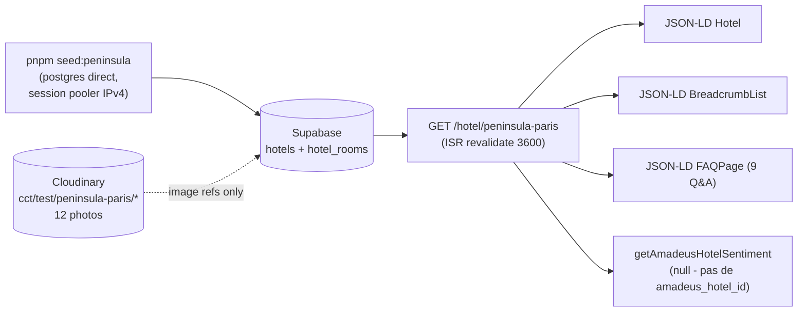

# Gap analysis — Fiche hôtel Peninsula Paris vs CDC §2

**Date** : 2026-05-11  
**Hôtel testé** : The Peninsula Paris — `slug=peninsula-paris`, ID Supabase `a237d595-1b07-477e-b908-a60e95e3d148`  
**Mode** : `display_only` (vitrine pure — `bookable = false`)  
**URL inspectée** : `http://localhost:3000/hotel/peninsula-paris` (200, 147 KB HTML)  
**Pré-requis** : seed exécuté via `pnpm --filter @cct/db seed:peninsula`. Rollback : `pnpm --filter @cct/db teardown:peninsula`.

## Sommaire

1. [Pipeline observé](#1-pipeline-observé)
2. [Vue globale par bloc CDC §2](#2-vue-globale-par-bloc-cdc-2)
3. [Détail bloc par bloc](#3-détail-bloc-par-bloc)
4. [JSON-LD livré vs CDC §2.15](#4-json-ld-livré-vs-cdc-215)
5. [Top 5 chantiers prioritaires Phase 10](#5-top-5-chantiers-prioritaires-phase-10)
6. [Gaps schéma Supabase à combler](#6-gaps-schéma-supabase-à-combler)
7. [Inventaire Cloudinary du test](#7-inventaire-cloudinary-du-test)
8. [Hors scope explicite](#8-hors-scope-explicite)
9. [Rollback](#9-rollback)

---

## 1. Pipeline observé



**Observations clé** :

- Insert idempotent OK (`xmax = 0` au premier run, `xmax != 0` au second).
- JSONB shapes correctes après bascule `sql.json()` (objet/array natif, plus de string scalar — bug détecté pendant ce test, voir §6).
- ISR fonctionnel (`revalidate = 3600` + slug pré-rendu via `generateStaticParams`).
- Mode `display_only` masque proprement le formulaire de réservation et affiche le CTA "Demander un devis par e-mail" (`/reservation/start`). Pas de fuite du chemin Amadeus.
- Sentiment Amadeus court-circuité (pas de `amadeus_hotel_id`) — bloc reviews breakdown absent, ce qui est le bon comportement.

---

## 2. Vue globale par bloc CDC §2

Score sur **5** par bloc. Notes :

- **0** = absent total
- **1-2** = présent mais minimal / non-conforme
- **3** = présent partiellement, structure OK
- **4** = présent, manque polish ou data
- **5** = conforme CDC §2

| #   | Bloc CDC §2                                  | Score | Priorité Phase 10 |
| --- | -------------------------------------------- | ----- | ----------------- |
| 1   | En-tête identité                             | 3/5   | P1                |
| 2   | Galerie média                                | 0/5   | **P0**            |
| 3   | Résumé factuel IA-ready (AEO)                | 3/5   | P2                |
| 4   | Description longue                           | 3/5   | P2                |
| 5   | Types de chambres                            | 2/5   | **P0**            |
| 6   | Équipements & services                       | 3/5   | P1                |
| 7   | Localisation (carte, POIs, transport)        | 1/5   | **P0**            |
| 8   | Moteur de réservation / display              | 4/5   | P2                |
| 9   | Politiques (annulation, check-in/out, taxes) | 0/5   | **P0**            |
| 10  | Avis & notes                                 | 1/5   | P1                |
| 11  | FAQ                                          | 4/5   | P2                |
| 12  | Restaurants, spa, expériences                | 1/5   | P1                |
| 13  | Réassurance / agence IATA                    | 2/5   | P1                |
| 14  | B2B / MICE                                   | 0/5   | P3                |
| 15  | Specs techniques (Schema.org, hreflang, ISR) | 4/5   | P2                |

**Total : 34/75** (~45 %). Acceptable pour un proto, **insuffisant** pour publier un palace face à la concurrence (Booking, Mr & Mrs Smith, AOR Hotels).

---

## 3. Détail bloc par bloc

### Bloc 1 — En-tête identité — 3/5

**Observé**

- `<h1>` : "The Peninsula Paris" ✓
- Badge "PALACE" (rouge ambré, traduction `hero.palace`) ✓
- Breadcrumb FR : Accueil → Hôtels → Paris → The Peninsula Paris ✓
- Hiérarchie typographique correcte (font-serif, sizes responsive) ✓

**Manquant (CDC §2.1)**

- **Sélecteur de langue** (`<LanguageSwitcher />`) : absent du header de la page.
- **Sélecteur de devise** EUR / USD / GBP / CHF : pas du tout dans le code.
- **Bouton "Favori"** (cœur, ajoute à un wishlist) : absent (pas de collection `user_favorites` côté Supabase non plus).
- **Bouton "Partager"** (Web Share API + copie de lien) : absent.

**Action Phase 10** : composant `<HotelHeaderActions locale currency favorited shareUrl />` côté droit du H1, plus migration `user_favorites` (auth requise).

### Bloc 2 — Galerie média — 0/5 **🚨 P0**

**Observé**

- **AUCUNE** photo rendue sur la fiche. La page renvoie 0 URL Cloudinary, 0 `next/image`, 0 `` lié au hôtel.

**Cause racine**

- La table `public.hotels` n'a **aucune colonne image** (vérifié `0001_init_core_schema.sql`). Cf. §6.
- Le composant `HotelImage` (`packages/ui`) existe mais n'est consommé nulle part dans `app/[locale]/hotel/[slug]/page.tsx`.
- Les 12 photos uploadées sur Cloudinary (folder `cct/test/peninsula-paris/`) n'ont **aucune référence en base** au niveau hôtel — seules `hotel_rooms.images` est exploitée (1 chambre sur 3 a 2 photos).

**Action Phase 10**

1. Migration `0008_hotels_media.sql` :
   - `featured_image jsonb` (1 image héro, public_id + alt_fr/en + dominant_color)
   - `gallery_images jsonb[]` (10+ images, schéma `{public_id, alt_fr, alt_en, category, caption_fr, caption_en, sort_order}`)
   - `video_tour jsonb` (Cloudinary video public_id + poster + transcript_fr/en)
   - `virtual_tour_url text` (Matterport)
2. Composant `<HotelGallery />` (server-rendered grid, client-side lightbox, lazy hors-viewport, `priority` sur héro).
3. Categories selon CDC §2.2 : extérieur, lobby, chambre, salle de bain, restaurant, spa, piscine, vue, équipements, événementiel — au moins 1 photo / catégorie.
4. JSON-LD `Hotel.image[]` (au moins 5 URLs, format absolu) + `Hotel.photo[]`.

### Bloc 3 — Résumé factuel IA-ready (AEO) — 3/5

**Observé**

- Bloc `<section data-aeo>` rendu avec H2 "Comment réserver The Peninsula Paris via ConciergeTravel ?" et answer de 50-80 mots.
- Inclus dans FAQPage JSON-LD (position 0).
- Cible explicite : Perplexity / SearchGPT / Gemini.

**Manquant (CDC §2.3)**

- **Pas de "Factual Summary" en début de page** : on attendrait un bloc structuré "Address: 19 Avenue Kléber, 75116 Paris. Stars: 5. Palace: yes. Rooms: 200, suites: 87. Michelin stars: 2. Spa: 1,800 m²." LLM-parsable en 100 mots max.
- **Pas de bloc `data-freshness` visible** indiquant la date de dernière mise à jour (le code expose `aeoFreshness` en interne mais ne le rend pas dans une section dédiée).
- L'unique question AEO est générique ("Comment réserver…"), ne couvre pas les 3-4 questions canoniques (cf. skill `geo-llm-optimization` : "Quelle est l'adresse de X ?", "Combien coûte une nuit en moyenne ?", "Quel est le restaurant phare ?").

**Action Phase 10** : composant `<HotelFactSheet />` rendu juste sous le H1 (avant l'AEO actuel) — `<dl>` avec 8-10 lignes factuelles + `aria-label="Fiche d'identité"`.

### Bloc 4 — Description longue — 3/5

**Observé**

- 2 paragraphes (210 mots FR cumulés), `split(/\n\n+/)` rendu via `<p>` séparés. ✓
- Bilingue (description_fr + description_en, fallback géré). ✓

**Manquant (CDC §2.4)**

- **Cible 600-1000 mots non atteinte** (~210 mots actuellement) — sous-classé vs Booking (qui agrège 2-3 paragraphes commerciaux + 1 paragraphe propriétaire).
- **Pas de sous-sections H3** (histoire, design, expérience, signature). Tout est plat.
- **Aucune ancre intra-page** vers ces H3, donc TOC inutilisable.
- **Pas d'extraction automatique** des entités nommées (Atout France, Henry Leung, David Bizet, …) → manque pour les Knowledge Graph queries.

**Action Phase 10** : extension `hotels.long_description_fr` / `_en` (markdown structuré, parser via `remark` pour rendre les H3 + générer TOC server-side).

### Bloc 5 — Types de chambres — 2/5 **🚨 P0**

**Observé** (3 chambres seedées)

```
deluxe-room (40 m², 2 pax, King size) — 6 amenities, 0 photo
premier-room (50 m², 2 pax, King size) — 5 amenities, 0 photo
eiffel-tower-suite (90 m², 3 pax, King + canapé) — 5 amenities, 2 photos
```

- Liste rendue avec `<h3>` + occupancy + size_sqm + bed_type ✓
- Description par chambre rendue ✓
- Amenities en `<li>` (tag-like) ✓

**Manquant (CDC §2.5 + ADR-0009)**

- **0 photo de chambre rendue** sur la fiche (alors que `hotel_rooms.images` jsonb existe + 2 photos de suite référencées en DB pour `eiffel-tower-suite`). Le composant page.tsx n'iter pas sur `room.images`.
- **Pas de fourchette de prix** ("À partir de 1 500 €/nuit"). Sans ARI Amadeus (display_only), il faudrait un champ `room.indicative_price_minor` en jsonb + flag "indicatif TTC EUR".
- **Pas de sous-page `/hotel/<slug>/chambres/<room-slug>`** alors que ADR-0009 le prescrit (collection Payload `Rooms`, route indexable, 5+ photos, Schema `Room` + `Offer`).
- **Pas de badge "Suite signature"** sur l'Eiffel Tower Suite (champ `is_signature` à ajouter au schema rooms).
- **Pas de comparateur visuel** entre les 3 catégories de chambres (tableau / grid).

**Action Phase 10**

1. Migration `0009_hotel_rooms_extension.sql` : `slug text`, `is_signature boolean`, `indicative_price_minor jsonb` (`{from, currency}`), `display_order int`.
2. Sous-page `/hotel/[slug]/chambres/[roomSlug]` (ISR + JSON-LD `HotelRoom` + `Offer`).
3. Composant `<RoomCard />` consommant `room.images` (premier photo en hero card).
4. Anti-cannibalisation : `meta robots = "noindex"` sur fiche parent (à valider — ADR-0009 dit l'inverse, à trancher).

### Bloc 6 — Équipements & services — 3/5

**Observé**

- 15 amenities rendues en tag-like `<li>` ✓
- Labels bilingues correctement résolus (FR rendu en FR) ✓
- JSON-LD `amenityFeature` : 15 `LocationFeatureSpecification` avec `value: true` ✓

**Manquant (CDC §2.6)**

- **Pas de regroupement** par catégorie (Bien-être / Restauration / Services / Famille / Connectivité / Mobilité). Tout est en flat list.
- **Pas de pictogramme** par amenity (lucide-react ou inline SVG). L'œil est noyé dans le texte.
- **Pas de taxonomie normée** côté code — chaque seed peut inventer ses propres clés (`spa`, `indoor_pool`, `michelin_restaurant`, …). Cf. skill `content-modeling` qui prescrit une taxonomie alignée Booking / Mr & Mrs Smith.
- **Pas de "premium amenities" highlights** (les 4-5 trucs qui valent une étoile en plus — palanquage = pool, Michelin restaurant, spa premium).

**Action Phase 10** : table `public.amenity_taxonomy` (key, category, label_fr, label_en, icon_lucide_name, is_premium) + composant `<AmenitiesGrid grouped />`.

### Bloc 7 — Localisation — 1/5 **🚨 P0**

**Observé**

- Texte : "16ᵉ arrondissement · Île-de-France" sous le H1 ✓
- Lien "Voir sur la carte" (OpenStreetMap external) ✓
- Latitude/Longitude présents en DB + JSON-LD `geo` ✓

**Manquant (CDC §2.7)**

- **Aucune carte rendue dans la page** (pas de composant Mapbox/MapLibre/OSM static). Le lien externe casse le tunnel.
- **Aucun bloc POIs** (Arc de Triomphe à 400 m, Champs-Élysées à 600 m, Trocadéro à 800 m, Tour Eiffel à 1.4 km, …). Skill `seo-technical` les liste comme signaux LLM.
- **Aucun bloc transport** : aéroport CDG 25 km / 30 min (le seed n'a même pas de champ pour ça).
- **Pas de Schema.org `Place` ni `nearbyAttractions[]`** dans le JSON-LD.
- **Pas d'adresse postale complète** : `postalCode` est vide dans le JSON-LD (`PostalAddress.postalCode = ""`).

**Action Phase 10**

1. Migration `hotels.postal_code text`, `hotels.transport_info jsonb` (`{airport: {name, code, distance_km, time_minutes_typical}, metro: [{line, station, distance_m}]}`), `hotels.pois jsonb[]` (10 POIs max, `{name, type, distance_m, walking_time_min, schema_type}`).
2. Composant `<HotelMap />` (static map server-side, OSM tiles, marker custom).
3. Section `<NearbyAttractions />` (liste + distance + walking_time).
4. JSON-LD : enrichir `Hotel` avec `nearbyAttractions[].@type = Place`.

### Bloc 8 — Moteur de réservation / display — 4/5

**Observé**

- Mode `display_only` détecté correctement : pas de formulaire `<input name="checkIn">` rendu (vérifié dans le DOM). ✓
- CTA "Demander un devis par e-mail" rendu avec lien vers `/reservation/start?hotelId=…&hotelName=…&checkIn=…`. ✓
- PriceComparator client island chargé (mais retourne probablement vide sans Makcorps creds).
- Section "Vérifier les disponibilités" toujours présente avec H2 + intro, ce qui peut être déroutant en `display_only`.

**Manquant (CDC §2.8)**

- **Pas de message clair "Cet hôtel n'est pas en stock direct — réservation par concierge"** (UX un peu sec).
- **Pas de visibilité sur le délai de réponse** (24h / 48h / 1h ?).
- **Pas de formulaire inline** (date + email + message) — l'utilisateur doit naviguer vers `/reservation/start`, friction.

**Action Phase 10** : variant `<DisplayOnlyBookingCard />` avec micro-form inline (3 champs) + promesse de réponse < 24 h ouvrées + lien vers le full form. Plus mention IATA dans la section.

### Bloc 9 — Politiques — 0/5 **🚨 P0**

**Observé**

- **AUCUN bloc politiques** rendu. Le mot "annulation" n'apparaît nulle part dans la page.
- Le bloc "Peninsula Time" (check-in 6h, check-out 22h) figure dans les amenities et la FAQ — pas en section dédiée.

**Manquant (CDC §2.9)**

- Section "Avant votre séjour" / "Conditions" avec :
  - Check-in / Check-out (horaires normaux + Peninsula Time)
  - Politique d'annulation (gratuit jusqu'à J-X, retenue 1ère nuit après)
  - Animaux acceptés (oui, mais quel poids max ?)
  - Enfants (lit bébé gratuit, supplément enfant)
  - Taxe de séjour (Paris 16e ~4 €/pers/nuit en palace)
  - Petit-déjeuner inclus / en supplément
  - Modes de paiement acceptés
  - Wifi gratuit / payant

**Action Phase 10**

1. Migration `hotels.policies jsonb` avec un schéma Zod fort (`packages/domain/hotels/policies.ts`).
2. Composant `<HotelPolicies />` accordion (1 section dépliable par catégorie).
3. JSON-LD : `Hotel.checkinTime`, `Hotel.checkoutTime`, `Hotel.petsAllowed`.

### Bloc 10 — Avis & notes — 1/5

**Observé**

- Aucun bloc avis affiché (correct : `amadeus_hotel_id` null, `google_rating` null → branches "aggregateRating" du JSON-LD non émises).
- Le code expose un `aggregateRating` fallback vers `row.google_rating` si Amadeus null — pas exercé ici.

**Manquant (CDC §2.10)**

- **Pas d'agrégation multi-source** (Amadeus + Google + Tripadvisor + Forbes Travel Guide).
- **Pas de bloc "Distinctions"** rendant `award` côté UI (alors que le JSON-LD contient `"award": "Distinction Palace — Atout France"`). Les distinctions Forbes 5★, Michelin, World Travel Awards ne sont pas modélisées.
- **Pas de reviews texte** (1-3 quotes courtes en cohérence avec les guidelines Google Rich Results).

**Action Phase 10**

1. Migration `hotels.awards jsonb[]` (`{name, issuer, year, schema_type}`).
2. Composant `<HotelDistinctions />` avec pictos (Michelin star icon, Forbes shield, etc.).
3. Pipeline async récup Google Places review (déjà cron-planifié quelque part — à confirmer).

### Bloc 11 — FAQ — 4/5

**Observé**

- 9 Q&A rendues (1 AEO + 8 FAQ seed) en `<details>/<summary>` accordions ✓
- JSON-LD FAQPage avec 9 questions ✓
- Q&A bilingues, contenu factuel (adresse, restaurants, spa, palace, transport, animaux) ✓
- Skill `geo-llm-optimization` recommande 10-15 Q&A — on est à 9, à 1-2 questions près.

**Manquant (CDC §2.11)**

- **Pas de FAQ filtrée par "intention"** (avant booking, pendant séjour, après séjour) — petit polish UX.
- Une question "Quel est le prix moyen d'une nuit ?" manque (question canonique LLM).
- Les questions sont sérialisées dans `hotels.faq_content` jsonb — perfect cible Payload `Hotels.faq[]` quand on cablera la collection.

**Action Phase 10** : ajouter 2-3 Q&A canoniques + grouper visuellement en 3 thèmes.

### Bloc 12 — Restaurants, spa, expériences — 1/5

**Observé**

- `hotels.restaurant_info` et `hotels.spa_info` jsonb correctement persistés (7 restaurants, spa 1 800 m²).
- **Aucune section dédiée** dans la page : le contenu n'est PAS rendu (le code page.tsx ne lit ni `restaurant_info` ni `spa_info`).

**Manquant (CDC §2.12)**

- Section "Restaurants & bars" avec card par venue (nom, type, horaires, chef, étoiles Michelin, photo).
- Section "Spa & bien-être" (description, surface, soins, photos).
- Section "Expériences signature" (Peninsula Time, Rolls-Royce, Art in Residence).

**Action Phase 10** : composants `<HotelRestaurants />` et `<HotelSpa />` consommant les jsonb existants (déjà seedés !) + sectionnement Mermaid `<HotelSignatureExperiences />`.

### Bloc 13 — Réassurance / agence IATA — 2/5

**Observé**

- L'AEO answer mentionne déjà "agence IATA partenaire", "PCI-DSS 3-D Secure", "comparatif non affilié", "fidélité dès la 1ère nuit" ✓
- Aucune section "Pourquoi réserver via ConciergeTravel ?" rendue.

**Manquant (CDC §2.13)**

- Section dédiée avec 4 pillars : IATA / Prix net GDS / Paiement sécurisé / Programme fidélité.
- Bloc "À propos de ConciergeTravel" (1 paragraphe) avec lien vers `/qui-sommes-nous`.
- Trust badges (IATA #, Atout France IM, Forbes if relevant) — pas du tout présent en DB ni UI.

**Action Phase 10** : composant partagé `<AgencyTrustBlock />` rendu en bas de fiche.

### Bloc 14 — B2B / MICE — 0/5

**Observé** : rien.

**Cause** : la table `hotels` n'a aucun champ MICE.

**Manquant (CDC §2.14)** : section "Événements & séminaires" si l'hôtel propose (8 salles privées, table du chef LiLi). Pas critique pour Phase 10.

**Action** : reporté Phase 11/12 (skill `content-modeling` mentionne déjà `MiceEvents` collection).

### Bloc 15 — Specs techniques — 4/5

**Observé**

- ISR : `export const revalidate = 3600` ✓
- `generateStaticParams` pré-rend les slugs publiés FR+EN ✓
- `generateMetadata` : title (`meta_title_fr` 94 chars), description (143 chars), canonical (`/hotel/peninsula-paris`), hreflang fr-FR/en/x-default ✓
- JSON-LD Hotel + BreadcrumbList + FAQPage tous présents et well-formed ✓
- Hotel JSON-LD inclut : `name, url, description, starRating, award, address (sans postalCode), geo, amenityFeature[15]` ✓
- ⚠ `starRating` n'inclut pas `bestRating: "5"` (la skill `structured-data-schema-org` l'exige explicitement).
- ⚠ `PostalAddress.postalCode = ""` → invalide pour Rich Results.

**Manquant (CDC §2.15)**

- Hotel JSON-LD : pas de `image[]`, pas de `numberOfRooms`, pas de `petsAllowed`, pas de `checkinTime/checkoutTime`, pas de `aggregateRating`, pas de `Place` references, pas de `Award` array typé.
- LCP non mesuré ici (pas d'image héro à mesurer).
- Pas de `lastReviewed` ni `dateModified` sur Hotel JSON-LD (utile pour signal freshness LLM).

**Action Phase 10** : enrichir `packages/seo/src/builders/hotel.ts` une fois les nouveaux champs (`postal_code`, `policies`, `awards`, `gallery_images`) en base.

---

## 4. JSON-LD livré vs CDC §2.15

| Propriété                                                               | Présent | Note                                                 |
| ----------------------------------------------------------------------- | ------- | ---------------------------------------------------- |
| `@type: Hotel`                                                          | ✅      | OK                                                   |
| `name`, `url`, `description`                                            | ✅      | description tronquée à 500 chars                     |
| `starRating.ratingValue`                                                | ✅      | 5                                                    |
| `starRating.bestRating`                                                 | ❌      | Manque (recommandé "5")                              |
| `award`                                                                 | ✅      | "Distinction Palace — Atout France"                  |
| `address.streetAddress, addressLocality, addressCountry, addressRegion` | ✅      | OK                                                   |
| `address.postalCode`                                                    | ⚠️      | Présent mais **vide**                                |
| `geo.latitude/longitude`                                                | ✅      | 48.8702 / 2.2932                                     |
| `amenityFeature[]`                                                      | ✅      | 15 features, `LocationFeatureSpecification`          |
| `image[]`                                                               | ❌      | **Aucune** (Hotel-level images non modélisées en DB) |
| `numberOfRooms`                                                         | ❌      | Manque (200 connu pourtant)                          |
| `petsAllowed`                                                           | ❌      | Manque                                               |
| `checkinTime / checkoutTime`                                            | ❌      | Manque                                               |
| `priceRange`                                                            | ❌      | Pas de fourchette de prix                            |
| `aggregateRating`                                                       | ❌      | Pas de data Amadeus/Google sur cet hôtel             |
| `containsPlace[]` (rooms)                                               | ❌      | Sous-pages chambres pas câblées                      |
| `Place` references (Arc de Triomphe, …)                                 | ❌      | POIs non modélisés                                   |

---

## 5. Top 5 chantiers prioritaires Phase 10

Classés par **impact UX × cost SEO/LLM**, données-driven (cette fiche est représentative d'un palace classique) :

### Chantier 1 — Galerie média + colonne `hotels.gallery_images` (P0 — bloque la conversion)

**Effort** : 1.5 semaine.  
**Livrables** : migration `0008`, composant `<HotelGallery />` avec lightbox, intégration dans page.tsx, JSON-LD `Hotel.image[]`, 10+ photos seed par hôtel pilote (Peninsula = OK, à dupliquer Bristol + Cheval Blanc + Hôtel du Cap).

### Chantier 2 — Sous-pages chambres `/hotel/<slug>/chambres/<roomSlug>` (P0 — captation longue-traîne)

**Effort** : 1 semaine.  
**Livrables** : migration `0009` (slug, is_signature, indicative_price), route Next.js, ISR, JSON-LD `Hotel.containsPlace[]` + page `HotelRoom`/`Offer`, anti-cannibalisation (canonical / robots).

### Chantier 3 — Localisation enrichie (carte + POIs + transport) (P0 — différenciateur palace)

**Effort** : 1 semaine.  
**Livrables** : migration `transport_info` + `pois` jsonb, composant `<HotelMap />` server (OSM static + marker), section `<NearbyAttractions />`, JSON-LD `Place` refs, completion `postalCode`.

### Chantier 4 — Politiques structurées (`hotels.policies` jsonb) (P0 — exigé pour passer en `amadeus` mode)

**Effort** : 0.5 semaine.  
**Livrables** : migration + Zod schema (`@cct/domain`), composant `<HotelPolicies />` accordion, JSON-LD `checkinTime/checkoutTime/petsAllowed`.

### Chantier 5 — Restaurants & spa rendus depuis le jsonb existant (P1 — free win, données déjà en base)

**Effort** : 0.5 semaine. Pas de migration : les jsonb `restaurant_info` / `spa_info` sont déjà persistés (vérifié pendant ce test). On rate juste le rendu.  
**Livrables** : composants `<HotelRestaurants />` + `<HotelSpa />`.

**Total Phase 10 cible** : ~4.5 semaines pour atteindre **~55/75 (~73 %)** — niveau publication acceptable pour un palace.

---

## 6. Gaps schéma Supabase à combler

Migrations à séquencer pour la Phase 10 :

| Migration                        | Colonnes ajoutées                                                                              | Bloc CDC |
| -------------------------------- | ---------------------------------------------------------------------------------------------- | -------- |
| `0008_hotels_media.sql`          | `featured_image jsonb`, `gallery_images jsonb`, `video_tour jsonb`, `virtual_tour_url text`    | §2.2     |
| `0009_hotel_rooms_extension.sql` | `slug text NOT NULL`, `is_signature bool`, `indicative_price_minor jsonb`, `display_order int` | §2.5     |
| `0010_hotels_location.sql`       | `postal_code text NOT NULL`, `transport_info jsonb`, `pois jsonb`                              | §2.7     |
| `0011_hotels_policies.sql`       | `policies jsonb` (check-in/out, cancellation, pets, taxes, payment)                            | §2.9     |
| `0012_hotels_awards.sql`         | `awards jsonb[]` (`{name, issuer, year, url}`)                                                 | §2.10    |
| `0013_amenity_taxonomy.sql`      | nouvelle table `public.amenity_taxonomy`                                                       | §2.6     |
| `0014_hotels_meta_extra.sql`     | `number_of_rooms int`, `number_of_suites int`, `opened_at date`, `last_renovated_at date`      | §2.15    |

**Bug détecté pendant ce test (déjà corrigé dans `seed-peninsula-paris.ts`)** : le pattern `${JSON.stringify(array)}::jsonb` utilisé dans [seed-dev.ts](../../packages/db/scripts/seed-dev.ts) écrit un **scalaire JSON string** quand les valeurs sont des arrays d'objets (`jsonb_typeof = 'string'` au lieu de `'array'`). Pour les seeds dev existants, les `amenities/highlights` sont des arrays de strings simples donc ça passe — mais c'est à corriger.

Patch à appliquer dans `seed-dev.ts` :

```diff
- amenities = ${JSON.stringify(seed.amenities)}::jsonb,
+ amenities = ${sql.json(seed.amenities as readonly unknown[] as postgres.JSONValue)},
```

---

## 7. Inventaire Cloudinary du test

Cloud `dvbjwh5wy` — folder `cct/test/peninsula-paris/` — tags `cct:test:peninsula`, `cct:test-data-not-prod`, `cct:source:wikimedia-commons` (CC licence).

| Public ID                   | Catégorie  | Dim       |
| --------------------------- | ---------- | --------- |
| `exterior-1`                | exterior   | 3840×2880 |
| `exterior-2`                | exterior   | 3840×2559 |
| `exterior-3`                | exterior   | 3840×2560 |
| `exterior-4`                | exterior   | 3840×2880 |
| `exterior-5`                | exterior   | 1920×2880 |
| `exterior-6`                | exterior   | 3840×2120 |
| `suite-eiffel-1`            | suite      | 3840×2880 |
| `suite-rooftop-1`           | suite      | 3840×2880 |
| `restaurant-oiseau-blanc-1` | restaurant | 3840×2560 |
| `restaurant-oiseau-blanc-2` | view       | 1920×1280 |
| `pool-spa-1`                | spa        | 3840×2561 |
| `service-rolls-1`           | service    | 3840×2408 |

**Catégories CDC §2.2 non couvertes par ce test** : lobby (rien sur Wikimedia), salle de bain (idem), événementiel (idem). À shooter en interne quand l'hôtel sera passé en `amadeus` ou `little` mode.

---

## 8. Hors scope explicite

- **Pas de collection Payload `Hotels`** — Phase 8 à venir, ce test ne câble pas le back-office.
- **Pas d'`amadeus_hotel_id`** sur cet hôtel (lead time externe, compte sandbox).
- **Pas de modélisation Place / Award / MiceEvents** — ces collections sont prescrites par les skills mais leurs migrations sont chantier Phase 10/11.
- **Pas de Lighthouse** détaillé : la fiche en l'état n'a pas d'image héro, donc le LCP est artificiellement bon et non représentatif. Le mesurer **après** chantier 1 (galerie) aura plus de sens.

---

## 9. Rollback

Une commande, retour à zéro instantané :

```bash
pnpm --filter @cct/db teardown:peninsula
```

- Supprime la ligne `hotels` correspondante.
- `hotel_rooms` cascade automatiquement via la FK `ON DELETE CASCADE`.
- Les 12 assets Cloudinary **ne sont pas** supprimés (intentionnel — réutilisables pour Phase 10). Pour les wipe : utiliser la console Cloudinary avec le tag `cct:test:peninsula` (cloud `dvbjwh5wy`).
